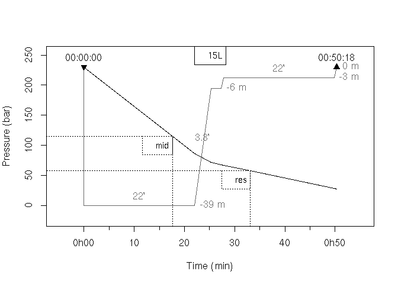

<!-- README.md is generated from README.Rmd. Please edit that file -->

# DiveR 

<!-- badges: start -->

[](https://www.tidyverse.org/lifecycle/#experimental)
[](https://github.com/gowachin/DiveR)
[](https://github.com/gowachin/DiveR/actions)
[](https://codecov.io/github/gowachin/DiveR?branch=master)

<!-- badges: end -->

R package for dive planification tools. It contains functions and
methods to represent dive curves, desaturation time and gas consumption.

At this day, only mn90 tables models are coded for single, consecutive
or successive dives. This mean all profile are square ones and only
maximum depth and dive time are used to compute desaturation.

Future parts are work in progress, like more precise planification setup
with different depths and time input. Desaturation planification with
other models are also planned along with maybe other gas than air
supported for consumption.

Intended to be used by french dive student, traduction of the lexic is
on it’s way. Feel free to participate to this project, it is designed to
be open source under a [CECILL-2
Licence](https://github.com/gowachin/DiveR/blob/master/LICENCE-CECILL-2.1.txt).
Any help in traduction or documentation is welcome (see end of README).

## Installation

### Dependencies

This package relies on very few packages listed below, that you can
install with the following code.

``` r
for (i in c('graphics', 'stats', 'viridisLite') ){
  if(!require(i,character.only = TRUE))
    install.packages(i)
}
```

### Development version

You can install the development version of `{DiveR}` from
[github](https://github.com/gowachin/DiveR) with:

``` r
# install.packages("devtools")
devtools::install_github('https://github.com/gowachin/DiveR')
# or 
# install.packages("remotes")
remotes::install_github("gowachin/DiveR")
```

<!--## Usage-->

This is a simple example where we simulate a dive. This show also the
desaturation stops due in the table model.

``` r
# Simulation of a dive
library(DiveR)
dive <- dive(depth = 39, time = 22, secu = TRUE, 
             ascent_speed = 10, desat_model = "table")
summary(dive)
#> --------------------------------------------------
#> Maximum depth :  39 m  | Depth dive time :  22 min 
#>  Dive ascent :  28 min | Underwater time :  50 min
#>   Majoration :   0 min | Security stop :  TRUE 
#>   Start :     00:00:00 | End :     00:50:18 
#> --------------------------------------------------
#> 
#> |- Desaturation -|
#> ---------------------------------
#>  Stop | Depth | Duration |   Time 
#> ---------------------------------
#>  n  2 |   6 m |    2 min | 25 min 
#> ---------------------------------
#>  n  3 |   3 m |   22 min | 28 min 
#> ---------------------------------
#>     Group : J | Model :   table
```

From the precedent dive you can check if you can survive with certain
tank pressure.

``` r
tank <- tank(vol = 15, press = 230, name = "15L")
conso <- conso(dive = dive, tank = tank, cons = 20)
summary(conso)
#> Consumption simulated on dive at 39 m for 50.3 minutes
#> ---------------------------------------------------------------------
#>        Tank name |         Rule | Pressure |    Time | Final pressure 
#> ---------------------------------------------------------------------
#>         Tank 15L |          mid |  115 bar |  18 min | 27.83 bar
#>                  |          res |   58 bar |  33 min |    
#>                  |           AF |    0 bar |  NA min |     
#> ---------------------------------------------------------------------
#> The dive is viable !
plot(conso, line_print = FALSE)
```



## Documentation

For further information, check the vignettes describing above examples
in more depth.

### Dive planification

Read [Dive
planification](https://gowachin.github.io/DiveR/articles/dive_planif.html)
Vignette to learn how to simulate dives under table desaturation model.

### Gas Consumption

Read [Gas
Consumption](https://gowachin.github.io/DiveR/articles/gas_conso.html)
Vignette to learn how to simulate the use of gas during a dive.

## Disclaimer

This application is intended for use in education about scubadiving
planification and academic interest only. It is not designed for actual
use in scuba diving and underwater activity. It is emphatically not
suitable for use in actual diving. Scuba diving is a dangerous activity
with risks of death and serious injury. No-one should attempt scuba
diving without training, certification, supervision and regular medical
assessment. It is also dangerous for trained scuba divers to exceed the
limitations of their training.

This application will provide planification about dive profile and air
consumption, without giving any warning if the activity would be
dangerous or fatal. In doing so, it does not take account of safety
restrictions, other physical laws, or other important information.
Despite using diving table as base for computation, no output from this
application should be misconstrued as a diving table. The author does
not warrant that the application is correct in any sense whatsoever.
Even if correctly computed, the predictions of a theoretical physical
model may not be correct predictions.

Note here that all dives simulated will also being at sea level.

## Want to help ?

Go check the [projects](https://github.com/gowachin/DiveR/projects) of
this repository ! Any help is welcome and I accept all sort of ideas for
future project. The idea of this package is to learn about process like
desaturation models and turn them into algorithms. If you want to use a
specific model, join me and we can try to implement it !

Feel free to fork this, and use it. Any recommendation is welcome :)
